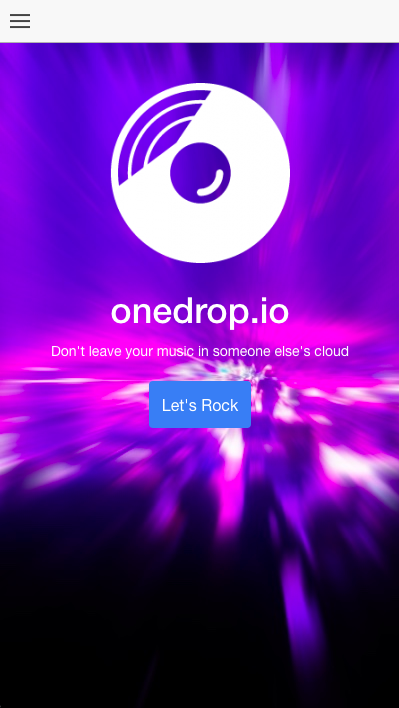

# onedrop.io

Customizable cross platform music player.

You can view the demo [here](http://onedrop.io/info.html).

### Works On Many Platforms

Using browser technology we are able to create one codebase that works on many platforms.

* Web/Browser via Docker
* iOS
* Android
* MacOS
* Windows
* Linux

### Build: Web via Docker

* ./build-docker.sh
* Navigate to http://your.ip.address on server
* Email: admin@example.com
* Password: password

### Build: iOS

* ./build-ios.sh
* Open XCode, add signing team, and then add background permissions
* Push it to your phone to test the builds
* Email: admin@example.com
* Password: password

### Build: Android

* ./build-android.sh
* This will generate an APK than you can install on your phone
* adb install /path/to/app.apk
* Email: admin@example.com
* Password: password

### Building for Desktop Platform

* There is another repo for building for MacOS, Windows, and Linux. You can find that here. [https://github.com/phishy/onedrop-desktop]()

### Thanks

We would like to thank [BrowserStack](https://www.browserstack.com/) for allowing us to use their service to do our cross-browser testing with amazing ease.
